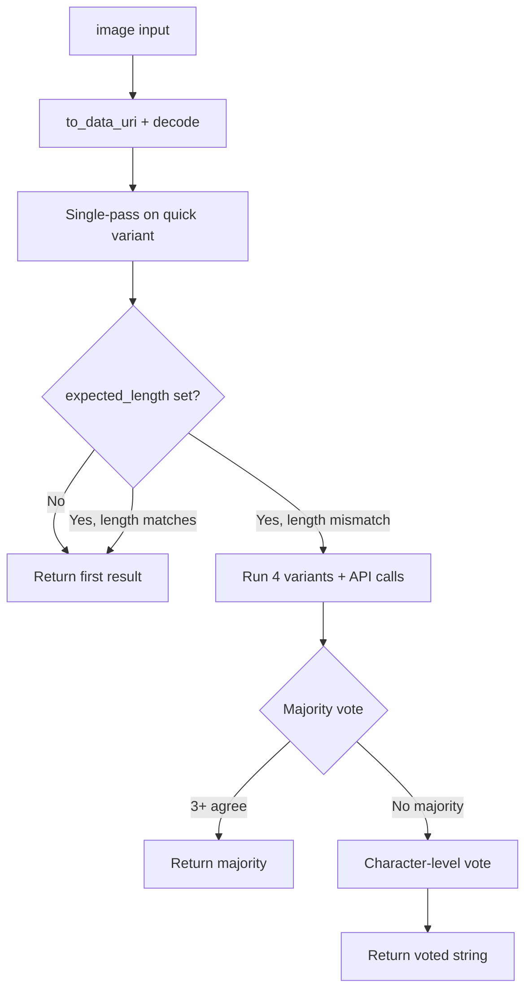

# OCR (Captcha Recognition) Documentation

## Table of Contents
- [How to Use in Your Project](#how-to-use-in-your-project)
  - [Quick Start Guide](#quick-start-guide)
- [Overview](#overview)
- [Recognition Flow](#recognition-flow)
- [Function: recognize_captcha](#function-recognize_captcha)
- [Class: CaptchaRecognizer](#class-captcharecognizer)
  - [Initialization](#initialization)
  - [recognize](#recognize)
  - [Static Helpers](#static-helpers)
- [Image Input Formats](#image-input-formats)
- [expected_length Behavior](#expected_length-behavior)
- [Verbose Output](#verbose-output)
- [Usage Examples](#usage-examples)

## How to Use in Your Project

The `ocr` module recognizes alphanumeric captcha text from images using Google Gemini vision models and OpenCV preprocessing.

### Quick Start Guide

1. **Import and call**:
    ```python
    from vdx_auto_utils import recognize_captcha

    text = recognize_captcha(
        api_key="your-gemini-api-key",
        model="gemma-4-31b-it",
        image="./captcha.png",
    )
    ```

2. **Or use a reusable instance** for multiple images:
    ```python
    from vdx_auto_utils import CaptchaRecognizer

    ocr = CaptchaRecognizer(api_key="...", model="gemma-4-31b-it")
    text = ocr.recognize("https://example.com/captcha.png")
    ```

---

## Overview

`src/vdx_auto_utils/ocr.py` provides:

- **Image normalization** — accepts data URIs, file paths, HTTP(S) URLs, or raw base64 strings
- **OpenCV preprocessing** — upscaling, grayscale, thresholding, and multiple image variants
- **Gemini vision API** — sends preprocessed images to a Google model with a captcha-specific prompt
- **Ensemble voting** (optional) — when `expected_length` is set and the first pass length does not match, runs extra variants and votes on results

---

## Recognition Flow



1. **Single-pass** — one API call on the fastest preprocessed variant.
2. **Ensemble** (only when `expected_length` is provided and the first result length differs) — four variants, up to four more API calls, then majority or per-character voting.

Transient API `500` errors are retried silently (default 5 attempts, 10 s delay).

---

## Function: `recognize_captcha`

```python
def recognize_captcha(
    api_key: str,
    model: str,
    image: str,
    expected_length: Optional[int] = None,
    verbose: bool = False,
) -> str
```

One-shot helper that creates a `CaptchaRecognizer`, runs recognition, and returns the text.

| Parameter | Description |
|-----------|-------------|
| `api_key` | Google Gemini API key |
| `model` | Model id (e.g. `gemma-4-31b-it`) |
| `image` | See [Image Input Formats](#image-input-formats) |
| `expected_length` | If set, enables ensemble when the first pass length differs. If omitted (`None`), returns the first pass result only |
| `verbose` | `False`: prints `Processing captcha...` then the result (or failure). `True`: prints step-by-step details |

**Returns:** Uppercase alphanumeric string (non-allowed characters stripped).

**Raises:** Propagates errors from image loading, API failures, or decoding; prints a failure message to stdout before raising.

---

## Class: `CaptchaRecognizer`

### Initialization

```python
CaptchaRecognizer(
    api_key: str,
    model: str,
    expected_length: Optional[int] = None,
    max_retries: int = 5,
    retry_delay: int = 10,
)
```

| Parameter | Default | Description |
|-----------|---------|-------------|
| `api_key` | — | Google Gemini API key |
| `model` | — | Gemini model id |
| `expected_length` | `None` | Default length for ensemble voting on `recognize()` |
| `max_retries` | `5` | Max attempts per variant on retryable API errors |
| `retry_delay` | `10` | Seconds between retries |

### `recognize`

```python
def recognize(
    self,
    data_uri: str,
    expected_length: Optional[int] | object = _UNSET,
    verbose: bool = False,
) -> str
```

| Parameter | Description |
|-----------|-------------|
| `data_uri` | Image input (any supported format) |
| `expected_length` | Omit to use the instance default. Pass `None` explicitly to skip length checks and always return the first pass |
| `verbose` | Controls console output (see [Verbose Output](#verbose-output)) |

### Static Helpers

These can be used without calling the full recognition pipeline:

```python
CaptchaRecognizer.to_data_uri(image: str, timeout: int = 30) -> str
CaptchaRecognizer.decode_data_uri(data_uri: str) -> np.ndarray
CaptchaRecognizer.clean_result(text: str) -> str
CaptchaRecognizer.img_to_bytes(img: np.ndarray) -> bytes
```

| Method | Purpose |
|--------|---------|
| `to_data_uri` | Convert path, URL, base64, or existing data URI to `data:image/...;base64,...` |
| `decode_data_uri` | Decode a data URI to an OpenCV BGR `numpy` array |
| `clean_result` | Uppercase, remove spaces, keep only `A–Z` and `0–9` |
| `img_to_bytes` | Encode an OpenCV image as PNG bytes for the API |

---

## Image Input Formats

The `image` / `data_uri` argument accepts:

| Format | Example |
|--------|---------|
| Data URI | `data:image/png;base64,iVBORw0KGgo...` |
| File path | `./captcha.png` or `C:\path\to\cap.png` |
| HTTP(S) URL | `https://example.com/captcha.png` |
| Raw base64 | `iVBORw0KGgoAAAANSUhEUg...` (no `data:image` prefix) |

---

## `expected_length` Behavior

| Value | Behavior |
|-------|----------|
| `None` (default) | Single API call; return whatever length the model returns |
| `6` (example) | If the first pass is not 6 characters, run ensemble + voting |
| Set on instance + omit in `recognize()` | Uses instance `expected_length` |
| Pass `None` to `recognize(..., expected_length=None)` | Overrides instance default; single pass only |

Use a fixed length when you know the platform’s captcha size (e.g. always 6 characters). Omit it when captcha length varies by site.

---

## Verbose Output

| `verbose` | Console output |
|-----------|----------------|
| `False` | `Processing captcha...` then the captcha text (or `Captcha recognition failed: ...`) |
| `True` | Single-pass result, ensemble steps, vote details, and final result |

Third-party SDK loggers (`httpx`, `google_genai`, etc.) are set to `ERROR` so they do not flood the console. App-wide logging is not reconfigured.

---

## Usage Examples

### Basic (any length, one API call)

```python
from vdx_auto_utils import recognize_captcha

text = recognize_captcha(
    api_key="your-api-key",
    model="gemma-4-31b-it",
    image="./captcha.png",
)
```

### Fixed length with ensemble fallback

```python
text = recognize_captcha(
    api_key="your-api-key",
    model="gemma-4-31b-it",
    image="data:image/png;base64,...",
    expected_length=6,
    verbose=True,
)
```

### Reusable instance

```python
from vdx_auto_utils import CaptchaRecognizer

ocr = CaptchaRecognizer(
    api_key="your-api-key",
    model="gemma-4-31b-it",
    expected_length=5,
)

for path in ["cap1.png", "cap2.png", "cap3.png"]:
    print(ocr.recognize(path))
```

### Data URI from a file (helper only)

```python
from vdx_auto_utils import CaptchaRecognizer

uri = CaptchaRecognizer.to_data_uri("./captcha.png")
img = CaptchaRecognizer.decode_data_uri(uri)
```
